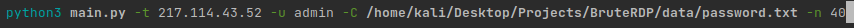
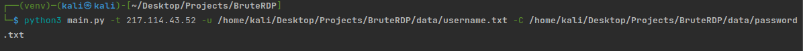

# BruteForce RDP protocol

## Инструкция

## Настройка Linux : 
### 1. ```python3 -m venv venv```
### 2. ```source venv/bin/activate```
### 3. ```pip install -r requirements.txt```
### 4. ```python3 main.py```

## Настройка Windows : 
### 1. ```python -m venv venv```
### 2. ```.\venv\Scripts\activate```
### 3. ```pip install -r requirements.txt```
### 4. ```python main.py```

## Аргументы:
### -h, --help ---> Получения дополнительной информации
### -t, --target ---> IP Адрес
### -p, --port ---> Порт RDP
### -u, --username ---> Имя пользователя для входа по rdp
### -U, --username_file ---> Имена пользователей для входа в систему, сохраненные в файле
### -c, --password ---> Пароль для входа по rdp
### -C, --password_file ---> Пароли для входа в систему, сохраненные в файле
### -n, --number ---> Количество потоков


## Пример:

## 
## 